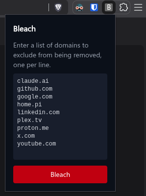

# Bleach

A Chrome extension that clears browsing data with support for a domain whitelist.



Install node, bun, clone this repository, then install the dependencies

```sh
git clone https://github.com/AlanMorel/bleach
```

```sh
cd bleach
```

```sh
bun install
```

Build the extension

```sh
bun run build
```

Load the extension in Chrome by going to `chrome://extensions`, enabling Developer Mode, and clicking "Load unpacked" — point it to the `dist/` folder.

Visit the extension popup by clicking the Bleach icon in your Chrome toolbar.
